# UrbanEase E-commerce Database

> A comprehensive MySQL database system for modern online retail platforms

---

## 📖 Table of Contents

- [What is UrbanEase?](#what-is-urbanease)
- [Project Purpose](#project-purpose)
- [Database Overview](#database-overview)
- [Database Architecture](#database-architecture)
- [Table Structure Documentation](#table-structure-documentation)
- [Entity Relationships](#entity-relationships)
- [Technical Specifications](#technical-specifications)
- [Database Design Principles](#database-design-principles)
- [Installation](#installation)

---

## What is UrbanEase?

**UrbanEase** is a production-ready e-commerce database system designed to power modern online retail platforms. It provides a complete data infrastructure for managing all aspects of an e-commerce business.

### Core Capabilities

The UrbanEase database handles:

- **User Management** - Customer accounts, authentication, and role-based access control
- **Product Catalog** - Hierarchical categories, products, and multiple product images
- **Inventory Management** - Multi-warehouse stock tracking with reservation system
- **Shopping Experience** - Shopping carts for registered users and guests
- **Promotions** - Flexible coupon system supporting percentage and fixed-amount discounts
- **Order Processing** - Complete order lifecycle from cart to fulfillment
- **Payment Processing** - Multi-provider payment tracking and transaction management
- **Shipping & Fulfillment** - Warehouse-based shipment tracking with carrier integration
- **Customer Engagement** - Product reviews and ratings system

---

## Project Purpose

This database was created as a college project to demonstrate:

1. **Database Design** - Proper normalization, relationships, and schema design
2. **SQL Proficiency** - Complex queries, joins, aggregations, and subqueries
3. **Business Logic** - Stored procedures for transaction processing
4. **Code Reusability** - User-defined functions for calculations
5. **Automation** - Triggers for data integrity and automatic updates
6. **Team Collaboration** - Version control and modular development

### Academic Context

- **Course**: Database Management Systems
- **Type**: Team project (6 members)
- **Database**: MySQL 8.0+
- **Focus**: Practical application of database concepts in real-world scenarios

---

## Database Overview

### Key Statistics

- **Database Name**: `urbanease_shop`
- **Total Tables**: 18
- **Storage Engine**: InnoDB (ACID compliant)
- **Character Set**: UTF-8 (utf8mb4)
- **Architecture**: Modular design with 6 functional domains

### Database Modules

The database is organized into 6 logical modules:

| Module | Tables | Purpose |
|--------|--------|---------|
| **User Management** | 3 tables | Authentication, roles, permissions |
| **Product Catalog** | 3 tables | Categories, products, images |
| **Inventory** | 3 tables | Variants, warehouses, stock levels |
| **Shopping Cart** | 3 tables | Carts, cart items, coupons |
| **Order Management** | 3 tables | Orders, line items, shipments |
| **Payments & Reviews** | 3 tables | Addresses, payments, product reviews |

---

## Database Architecture

### System Design

UrbanEase follows a normalized relational database design optimized for:
- Data integrity through foreign key relationships
- Performance through strategic indexing
- Scalability using BIGINT for high-volume tables
- Flexibility with JSON fields for dynamic attributes

### Entity Relationship Diagram (ERD)

#### Visual ERD

```mermaid
erDiagram
    %% ============================================
    %% MODULE 1: USER MANAGEMENT & AUTHENTICATION
    %% ============================================
    
    Users ||--o{ UserRoles : "has many"
    Roles ||--o{ UserRoles : "assigned to"
    Users ||--o{ Addresses : "has"
    Users ||--o{ Carts : "owns"
    Users ||--o{ Orders : "places"
    Users ||--o{ Reviews : "writes"
    
    Users {
        BIGINT user_id PK "Primary Key"
        VARCHAR email UK "Unique, NOT NULL"
        VARBINARY password_hash "NOT NULL"
        VARCHAR full_name
        VARCHAR phone
        BOOLEAN is_active "DEFAULT TRUE"
        DATETIME created_at
        DATETIME updated_at
    }
    
    Roles {
        INT role_id PK "Primary Key"
        VARCHAR role_name UK "Unique, NOT NULL"
    }
    
    UserRoles {
        BIGINT user_id PK,FK "Composite PK"
        INT role_id PK,FK "Composite PK"
        DATETIME assigned_at
    }
    
    Addresses {
        BIGINT address_id PK
        BIGINT user_id FK
        VARCHAR label "Home/Office"
        VARCHAR name
        VARCHAR line1
        VARCHAR line2
        VARCHAR city
        VARCHAR state_region
        VARCHAR postal_code
        CHAR country_code "ISO 2-char"
        VARCHAR phone
        BOOLEAN is_default
        DATETIME created_at
        DATETIME updated_at
    }
    
    %% ============================================
    %% MODULE 2: PRODUCT CATALOG
    %% ============================================
    
    Categories ||--o{ Categories : "parent-child"
    Categories ||--o{ Products : "contains"
    Products ||--o{ ProductImages : "has"
    Products ||--o{ ProductVariants : "has variants"
    Products ||--o{ Reviews : "receives"
    
    Categories {
        BIGINT category_id PK
        BIGINT parent_id FK "Self-reference"
        VARCHAR name
        VARCHAR slug UK "Unique, URL-friendly"
    }
    
    Products {
        BIGINT product_id PK
        BIGINT category_id FK
        VARCHAR title
        TEXT description
        VARCHAR brand
        BOOLEAN is_active
        DATETIME created_at
        DATETIME updated_at
    }
    
    ProductImages {
        BIGINT image_id PK
        BIGINT product_id FK
        VARCHAR url
        VARCHAR alt_text
        INT sort_order
    }
    
    %% ============================================
    %% MODULE 3: INVENTORY MANAGEMENT
    %% ============================================
    
    ProductVariants ||--o{ Inventory : "tracked in"
    Warehouses ||--o{ Inventory : "stores"
    ProductVariants ||--o{ CartItems : "in cart"
    ProductVariants ||--o{ OrderItems : "ordered"
    
    ProductVariants {
        BIGINT variant_id PK
        BIGINT product_id FK
        VARCHAR sku UK "Unique"
        JSON attributes_json "size,color,etc"
        DECIMAL price "CHECK >= 0"
        CHAR currency "DEFAULT USD"
        BOOLEAN is_active
        DATETIME created_at
        DATETIME updated_at
    }
    
    Warehouses {
        BIGINT warehouse_id PK
        VARCHAR name
        VARCHAR code UK "Unique"
        VARCHAR city
        VARCHAR state_region
        CHAR country_code "ISO 2-char"
    }
    
    Inventory {
        BIGINT warehouse_id PK,FK "Composite PK"
        BIGINT variant_id PK,FK "Composite PK"
        INT on_hand "CHECK >= 0"
        INT reserved "CHECK >= 0"
    }
    
    %% ============================================
    %% MODULE 4: SHOPPING CART & PROMOTIONS
    %% ============================================
    
    Carts ||--o{ CartItems : "contains"
    Coupons ||--o{ Orders : "applied to"
    
    Carts {
        BIGINT cart_id PK
        BIGINT user_id FK "NULL for guests"
        DATETIME created_at
        DATETIME updated_at
    }
    
    CartItems {
        BIGINT cart_item_id PK
        BIGINT cart_id FK
        BIGINT variant_id FK
        INT qty "CHECK > 0"
        DECIMAL unit_price
        DATETIME added_at
    }
    
    Coupons {
        BIGINT coupon_id PK
        VARCHAR code UK "Unique"
        VARCHAR type "PERCENT or AMOUNT"
        DECIMAL value "CHECK >= 0"
        DATETIME starts_at
        DATETIME expires_at
        DECIMAL min_subtotal
        BOOLEAN is_active
    }
    
    %% ============================================
    %% MODULE 5: ORDER MANAGEMENT & FULFILLMENT
    %% ============================================
    
    Orders ||--o{ OrderItems : "contains"
    Orders ||--o{ Payments : "paid via"
    Orders ||--o{ Shipments : "fulfilled by"
    Orders }o--|| Addresses : "ships to"
    Orders }o--|| Addresses : "bills to"
    Warehouses ||--o{ Shipments : "ships from"
    
    Orders {
        BIGINT order_id PK
        BIGINT user_id FK
        VARCHAR status "PENDING,PAID,etc"
        DECIMAL subtotal_amount
        DECIMAL discount_amount
        DECIMAL shipping_amount
        DECIMAL tax_amount
        DECIMAL grand_total "COMPUTED"
        BIGINT coupon_id FK
        BIGINT shipping_address_id FK
        BIGINT billing_address_id FK
        DATETIME placed_at
        DATETIME updated_at
    }
    
    OrderItems {
        BIGINT order_item_id PK
        BIGINT order_id FK
        BIGINT variant_id FK
        INT qty "CHECK > 0"
        DECIMAL unit_price
        DECIMAL tax_amount
        DECIMAL discount_amount
    }
    
    Shipments {
        BIGINT shipment_id PK
        BIGINT order_id FK
        BIGINT warehouse_id FK
        VARCHAR carrier
        VARCHAR tracking_no
        VARCHAR status "CREATED,IN_TRANSIT,etc"
        DATETIME shipped_at
        DATETIME delivered_at
        DATETIME created_at
    }
    
    %% ============================================
    %% MODULE 6: PAYMENTS & REVIEWS
    %% ============================================
    
    Payments {
        BIGINT payment_id PK
        BIGINT order_id FK
        VARCHAR provider "Stripe,PayPal,etc"
        VARCHAR provider_ref
        DECIMAL amount
        VARCHAR status "INITIATED,CAPTURED,etc"
        DATETIME paid_at
        DATETIME created_at
    }
    
    Reviews {
        BIGINT review_id PK
        BIGINT product_id FK
        BIGINT user_id FK
        TINYINT rating "CHECK 1-5"
        VARCHAR title
        TEXT body
        DATETIME created_at
    }
```



**Mermaid Cardinality Notation:**
- `||--o{` = One-to-Many (1:N) - One record on left relates to many on right
- `||--||` = One-to-One (1:1) - Exactly one on each side
- `}o--o{` = Many-to-Many (M:N) - Many on both sides (via junction table)
- `}o--||` = Many-to-One (N:1) - Many on left relate to one on right

**Legend:**
- `PK` = Primary Key
- `FK` = Foreign Key  
- `UK` = Unique Key
- `"text"` = Constraint or description

---

#### Detailed ASCII ERD with Complete Information

```
┌─────────────────────────────────────────────────────────────────────────────────────┐
│                           URBANEASE E-COMMERCE DATABASE                              │
│                          Entity Relationship Diagram (ERD)                           │
└─────────────────────────────────────────────────────────────────────────────────────┘

LEGEND:
  PK = Primary Key
  FK = Foreign Key
  1 ─── 1   = One-to-One
  1 ─── ∞   = One-to-Many
  ∞ ─── ∞   = Many-to-Many (via junction table)

═══════════════════════════════════════════════════════════════════════════════════════
MODULE 1: USER MANAGEMENT & AUTHENTICATION
═══════════════════════════════════════════════════════════════════════════════════════

     ┌─────────────────────┐
     │       Roles         │
     │─────────────────────│
     │ PK: role_id         │
     │     role_name       │
     └──────────┬──────────┘
                │
                │ 1
                │
                ∞
     ┌─────────────────────┐
     │     UserRoles       │◄────────────── Junction Table (Many-to-Many)
     │─────────────────────│
     │ PK: user_id, role_id│
     │ FK: user_id         │
     │ FK: role_id         │
     │     assigned_at     │
     └──────────┬──────────┘
                │
                │ ∞
                │
                │ 1
     ┌─────────────────────┐
     │       Users         │◄────────────── Core User Entity
     │─────────────────────│
     │ PK: user_id         │
     │     email (UNIQUE)  │
     │     password_hash   │
     │     full_name       │
     │     phone           │
     │     is_active       │
     │     created_at      │
     │     updated_at      │
     └──────────┬──────────┘
                │
                ├──────────────────────────────────────────────────────────┐
                │                                                          │
                │ 1                                                        │ 1
                │                                                          │
                ∞                                                          ∞
     ┌─────────────────────┐                                   ┌─────────────────────┐
     │     Addresses       │                                   │       Carts         │
     │─────────────────────│                                   │─────────────────────│
     │ PK: address_id      │                                   │ PK: cart_id         │
     │ FK: user_id         │                                   │ FK: user_id (NULL)  │◄─ NULL for guest
     │     label           │                                   │     created_at      │
     │     name            │                                   │     updated_at      │
     │     line1, line2    │                                   └──────────┬──────────┘
     │     city            │                                              │
     │     state_region    │                                              │ 1
     │     postal_code     │                                              │
     │     country_code    │                                              ∞
     │     phone           │                                   ┌─────────────────────┐
     │     is_default      │                                   │     CartItems       │
     │     created_at      │                                   │─────────────────────│
     │     updated_at      │                                   │ PK: cart_item_id    │
     └─────────────────────┘                                   │ FK: cart_id         │
                                                               │ FK: variant_id      │
                                                               │     qty             │
                                                               │     unit_price      │
                                                               │     added_at        │
                                                               └──────────┬──────────┘
                                                                          │
═══════════════════════════════════════════════════════════════════════════════════════
MODULE 2: PRODUCT CATALOG
═══════════════════════════════════════════════════════════════════════════════════════
                                                                          │
                                                                          │
     ┌─────────────────────┐                                              │
     │    Categories       │◄────────────── Self-Referencing (Hierarchy)  │
     │─────────────────────│                                              │
     │ PK: category_id     │                                              │
     │ FK: parent_id ──────┼─┐                                            │
     │     name            │ │                                            │
     │     slug (UNIQUE)   │ │                                            │
     └──────────┬──────────┘ │                                            │
                │            │                                            │
                └────────────┘                                            │
                │                                                         │
                │ 1                                                       │
                │                                                         │
                ∞                                                         │
     ┌─────────────────────┐                                             │
     │      Products       │◄────────────── Main Product Entity          │
     │─────────────────────│                                             │
     │ PK: product_id      │                                             │
     │ FK: category_id     │                                             │
     │     title           │                                             │
     │     description     │                                             │
     │     brand           │                                             │
     │     is_active       │                                             │
     │     created_at      │                                             │
     │     updated_at      │                                             │
     └──────────┬──────────┘                                             │
                │                                                         │
                ├─────────────────────────────┐                          │
                │                             │                          │
                │ 1                           │ 1                        │
                │                             │                          │
                ∞                             ∞                          │
     ┌─────────────────────┐       ┌─────────────────────┐              │
     │  ProductImages      │       │  ProductVariants    │◄──────────── Sellable SKUs
     │─────────────────────│       │─────────────────────│              │
     │ PK: image_id        │       │ PK: variant_id      │              │
     │ FK: product_id      │       │ FK: product_id      │              │
     │     url             │       │     sku (UNIQUE)    │              │
     │     alt_text        │       │     attributes_json │◄───── JSON: {"size":"M"}
     │     sort_order      │       │     price           │              │
     └─────────────────────┘       │     currency        │              │
                                   │     is_active       │              │
                                   │     created_at      │              │
                                   │     updated_at      │              │
                                   └──────────┬──────────┘              │
                                              │                         │
═══════════════════════════════════════════════════════════════════════════════════════
MODULE 3: INVENTORY MANAGEMENT                │                         │
═══════════════════════════════════════════════════════════════════════════════════════
                                              │                         │
                                              │ 1                       │
                                              │                         │
                                              ∞                         │
                                   ┌─────────────────────┐              │
                 ┌─────────────────┤     Inventory       │              │
                 │                 │─────────────────────│              │
                 │                 │ PK: warehouse_id,   │              │
                 │                 │     variant_id      │              │
                 │                 │ FK: warehouse_id    │              │
                 │                 │ FK: variant_id      │◄─────────────┤─── Links to Cart
                 │                 │     on_hand         │              │
                 │                 │     reserved        │              │
                 │                 └──────────┬──────────┘              │
                 │                            │                         │
                 │                            │ ∞                       │
                 │ 1                          │                         │
                 │                            │ 1                       │
     ┌─────────────────────┐                 │                         │
     │    Warehouses       │◄────────────────┘                         │
     │─────────────────────│                                            │
     │ PK: warehouse_id    │                                            │
     │     name            │                                            │
     │     code (UNIQUE)   │                                            │
     │     city            │                                            │
     │     state_region    │                                            │
     │     country_code    │                                            │
     └──────────┬──────────┘                                            │
                │                                                       │
                │                                                       │
═══════════════════════════════════════════════════════════════════════════════════════
MODULE 4: SHOPPING CART & PROMOTIONS (Continued from CartItems above)
═══════════════════════════════════════════════════════════════════════════════════════
                                                                        │
     ┌─────────────────────┐                                           │
     │      Coupons        │                                           │
     │─────────────────────│                                           │
     │ PK: coupon_id       │                                           │
     │     code (UNIQUE)   │                                           │
     │     type            │◄───── 'PERCENT' or 'AMOUNT'              │
     │     value           │                                           │
     │     starts_at       │                                           │
     │     expires_at      │                                           │
     │     min_subtotal    │                                           │
     │     is_active       │                                           │
     └──────────┬──────────┘                                           │
                │                                                       │
                │                                                       │
═══════════════════════════════════════════════════════════════════════════════════════
MODULE 5: ORDER MANAGEMENT & FULFILLMENT
═══════════════════════════════════════════════════════════════════════════════════════
                │                                                       │
                │ 1                                                     │
                │                                                       │
                ∞                                                       │
     ┌─────────────────────┐                                           │
     │       Orders        │◄──────────────────────────────────────────┘
     │─────────────────────│
     │ PK: order_id        │
     │ FK: user_id         │◄─────────────┐
     │ FK: coupon_id       │◄─────────────┼──── Links to Coupons
     │ FK: shipping_addr_id│◄─────────────┼──── Links to Addresses
     │ FK: billing_addr_id │◄─────────────┼──── Links to Addresses
     │     status          │◄── 'PENDING','PAID','FULFILLED', etc.
     │     subtotal_amount │
     │     discount_amount │
     │     shipping_amount │
     │     tax_amount      │
     │     grand_total ────┼──── COMPUTED: subtotal - discount + shipping + tax
     │     placed_at       │
     │     updated_at      │
     └──────────┬──────────┘
                │
                ├──────────────────────────────────────┐
                │                                      │
                │ 1                                    │ 1
                │                                      │
                ∞                                      ∞
     ┌─────────────────────┐            ┌─────────────────────┐
     │    OrderItems       │            │     Shipments       │
     │─────────────────────│            │─────────────────────│
     │ PK: order_item_id   │            │ PK: shipment_id     │
     │ FK: order_id        │            │ FK: order_id        │
     │ FK: variant_id      │            │ FK: warehouse_id    │◄──── Links to Warehouse
     │     qty             │            │     carrier         │
     │     unit_price      │            │     tracking_no     │
     │     tax_amount      │            │     status          │◄── 'CREATED','IN_TRANSIT', etc.
     │     discount_amount │            │     shipped_at      │
     └─────────────────────┘            │     delivered_at    │
                                        │     created_at      │
                                        └──────────┬──────────┘
                                                   │
                                                   │ ∞
                                                   │
                                                   │ 1
                                                   │
                                        ┌──────────┴──────────┐
                                        │   (Links to         │
                                        │    Warehouses)      │
                                        └─────────────────────┘

═══════════════════════════════════════════════════════════════════════════════════════
MODULE 6: PAYMENTS & REVIEWS
═══════════════════════════════════════════════════════════════════════════════════════

     ┌─────────────────────┐
     │      Payments       │
     │─────────────────────│
     │ PK: payment_id      │
     │ FK: order_id        │◄──────────────── Links to Orders
     │     provider        │◄──── 'Stripe','PayPal', etc.
     │     provider_ref    │
     │     amount          │
     │     status          │◄──── 'INITIATED','CAPTURED','REFUNDED', etc.
     │     paid_at         │
     │     created_at      │
     └─────────────────────┘


     ┌─────────────────────┐
     │      Reviews        │
     │─────────────────────│
     │ PK: review_id       │
     │ FK: product_id      │◄──────────────── Links to Products
     │ FK: user_id         │◄──────────────── Links to Users
     │     rating          │◄──── CHECK: 1-5
     │     title           │
     │     body            │
     │     created_at      │
     │                     │
     │ UNIQUE: (product_id,│◄──── One review per user per product
     │         user_id)    │
     └─────────────────────┘

═══════════════════════════════════════════════════════════════════════════════════════
KEY RELATIONSHIP SUMMARY
═══════════════════════════════════════════════════════════════════════════════════════

1. Users ↔ Roles (Many-to-Many via UserRoles junction table)
2. Users → Addresses (1:Many) - One user can have multiple addresses
3. Users → Carts (1:Many) - One user can have multiple carts (guest carts have NULL user_id)
4. Users → Orders (1:Many) - One user can place multiple orders
5. Users → Reviews (1:Many) - One user can write multiple reviews

6. Categories → Categories (1:Many) - Self-referencing for hierarchical structure
7. Categories → Products (1:Many) - One category contains multiple products
8. Products → ProductImages (1:Many) - One product can have multiple images
9. Products → ProductVariants (1:Many) - One product has multiple sellable variants
10. Products → Reviews (1:Many) - One product can have multiple reviews

11. ProductVariants ↔ Warehouses (Many-to-Many via Inventory junction table)
12. ProductVariants → CartItems (1:Many) - Variant can be in multiple carts
13. ProductVariants → OrderItems (1:Many) - Variant can be ordered multiple times

14. Carts → CartItems (1:Many) - One cart contains multiple items
15. Coupons → Orders (1:Many) - One coupon can be used in multiple orders

16. Orders → OrderItems (1:Many) - One order contains multiple items
17. Orders → Payments (1:Many) - One order can have multiple payment attempts
18. Orders → Shipments (1:Many) - One order can have multiple shipments
19. Orders → Addresses (Many:1) - Each order references shipping and billing addresses

20. Warehouses → Shipments (1:Many) - One warehouse fulfills multiple shipments

═══════════════════════════════════════════════════════════════════════════════════════
DESIGN HIGHLIGHTS
═══════════════════════════════════════════════════════════════════════════════════════

✓ Normalized to 3NF - Eliminates data redundancy
✓ Foreign Key Constraints - Ensures referential integrity
✓ Composite Keys - Used in junction tables (UserRoles, Inventory)
✓ Self-Referencing - Categories support hierarchical structure
✓ Computed Columns - grand_total_amount calculated automatically
✓ Flexible Attributes - JSON field for variant attributes (size, color, etc.)
✓ Guest Support - Carts allow NULL user_id for guest checkout
✓ Audit Trail - created_at and updated_at on most tables
✓ Status Tracking - Enum-like CHECK constraints for order/payment/shipment status
✓ Multi-Warehouse - Supports distributed inventory across locations

```

---

## Table Structure Documentation

### Module 1: User Management & Authentication

#### **Users**
Stores customer and administrator account information.

| Column | Type | Constraints | Description |
|--------|------|-------------|-------------|
| user_id | BIGINT | PRIMARY KEY, AUTO_INCREMENT | Unique identifier |
| email | VARCHAR(320) | UNIQUE, NOT NULL | User's email (login) |
| password_hash | VARBINARY(256) | NOT NULL | Encrypted password |
| full_name | VARCHAR(120) | NOT NULL | User's full name |
| phone | VARCHAR(32) | NULL | Contact number |
| is_active | BOOLEAN | DEFAULT TRUE | Account status |
| created_at | DATETIME | DEFAULT CURRENT_TIMESTAMP | Creation timestamp |
| updated_at | DATETIME | AUTO-UPDATE | Last modification |

#### **Roles**
Defines application roles (Admin, Customer, Manager, etc.).

| Column | Type | Constraints | Description |
|--------|------|-------------|-------------|
| role_id | INT | PRIMARY KEY, AUTO_INCREMENT | Role identifier |
| role_name | VARCHAR(64) | UNIQUE, NOT NULL | Role name |

#### **UserRoles** (Junction Table)
Many-to-many relationship between Users and Roles.

| Column | Type | Constraints | Description |
|--------|------|-------------|-------------|
| user_id | BIGINT | PRIMARY KEY (composite), FK → Users | User reference |
| role_id | INT | PRIMARY KEY (composite), FK → Roles | Role reference |
| assigned_at | DATETIME | DEFAULT CURRENT_TIMESTAMP | Assignment date |

---

### Module 2: Product Catalog

#### **Categories**
Hierarchical product taxonomy with parent-child relationships.

| Column | Type | Constraints | Description |
|--------|------|-------------|-------------|
| category_id | BIGINT | PRIMARY KEY, AUTO_INCREMENT | Category identifier |
| parent_id | BIGINT | NULL, FK → Categories | Parent category (self-reference) |
| name | VARCHAR(120) | NOT NULL | Category name |
| slug | VARCHAR(160) | UNIQUE, NOT NULL | URL-friendly identifier |

#### **Products**
Master product information.

| Column | Type | Constraints | Description |
|--------|------|-------------|-------------|
| product_id | BIGINT | PRIMARY KEY, AUTO_INCREMENT | Product identifier |
| category_id | BIGINT | NULL, FK → Categories | Product category |
| title | VARCHAR(200) | NOT NULL | Product name |
| description | TEXT | NULL | Detailed description |
| brand | VARCHAR(100) | NULL | Brand name |
| is_active | BOOLEAN | DEFAULT TRUE | Availability status |
| created_at | DATETIME | DEFAULT CURRENT_TIMESTAMP | Creation date |
| updated_at | DATETIME | AUTO-UPDATE | Last modification |

#### **ProductImages**
Multiple images per product with ordering.

| Column | Type | Constraints | Description |
|--------|------|-------------|-------------|
| image_id | BIGINT | PRIMARY KEY, AUTO_INCREMENT | Image identifier |
| product_id | BIGINT | NOT NULL, FK → Products | Product reference |
| url | VARCHAR(512) | NOT NULL | Image URL |
| alt_text | VARCHAR(160) | NULL | Accessibility text |
| sort_order | INT | DEFAULT 0 | Display order |

---

### Module 3: Inventory Management

#### **ProductVariants**
Sellable SKUs with pricing and attributes.

| Column | Type | Constraints | Description |
|--------|------|-------------|-------------|
| variant_id | BIGINT | PRIMARY KEY, AUTO_INCREMENT | Variant identifier |
| product_id | BIGINT | NOT NULL, FK → Products | Product reference |
| sku | VARCHAR(64) | UNIQUE, NOT NULL | Stock Keeping Unit |
| attributes_json | JSON | NULL | Variant attributes (size, color, etc.) |
| price | DECIMAL(12,2) | NOT NULL, CHECK ≥ 0 | Unit price |
| currency | CHAR(3) | DEFAULT 'USD' | Currency code |
| is_active | BOOLEAN | DEFAULT TRUE | Sales status |
| created_at | DATETIME | DEFAULT CURRENT_TIMESTAMP | Creation date |
| updated_at | DATETIME | AUTO-UPDATE | Last modification |

**JSON Example**: `{"size":"M","color":"Black"}`

#### **Warehouses**
Physical storage locations.

| Column | Type | Constraints | Description |
|--------|------|-------------|-------------|
| warehouse_id | BIGINT | PRIMARY KEY, AUTO_INCREMENT | Warehouse identifier |
| name | VARCHAR(120) | NOT NULL | Warehouse name |
| code | VARCHAR(32) | UNIQUE, NOT NULL | Warehouse code |
| city | VARCHAR(80) | NULL | City |
| state_region | VARCHAR(80) | NULL | State/region |
| country_code | CHAR(2) | NULL | Country code (ISO) |

#### **Inventory**
Stock levels per warehouse and variant.

| Column | Type | Constraints | Description |
|--------|------|-------------|-------------|
| warehouse_id | BIGINT | PRIMARY KEY (composite), FK → Warehouses | Warehouse reference |
| variant_id | BIGINT | PRIMARY KEY (composite), FK → ProductVariants | Variant reference |
| on_hand | INT | NOT NULL, CHECK ≥ 0 | Physical inventory |
| reserved | INT | DEFAULT 0, CHECK ≥ 0 | Reserved for orders |

**Available Stock** = `on_hand - reserved`

---

### Module 4: Shopping Cart & Promotions

#### **Carts**
Shopping carts for registered users and guests.

| Column | Type | Constraints | Description |
|--------|------|-------------|-------------|
| cart_id | BIGINT | PRIMARY KEY, AUTO_INCREMENT | Cart identifier |
| user_id | BIGINT | NULL, FK → Users | User reference (NULL for guests) |
| created_at | DATETIME | DEFAULT CURRENT_TIMESTAMP | Creation date |
| updated_at | DATETIME | AUTO-UPDATE | Last modification |

#### **CartItems**
Line items within carts.

| Column | Type | Constraints | Description |
|--------|------|-------------|-------------|
| cart_item_id | BIGINT | PRIMARY KEY, AUTO_INCREMENT | Item identifier |
| cart_id | BIGINT | NOT NULL, FK → Carts | Cart reference |
| variant_id | BIGINT | NOT NULL, FK → ProductVariants | Product variant |
| qty | INT | NOT NULL, CHECK > 0 | Quantity |
| unit_price | DECIMAL(12,2) | NOT NULL, CHECK ≥ 0 | Price at add time |
| added_at | DATETIME | DEFAULT CURRENT_TIMESTAMP | Added timestamp |

#### **Coupons**
Promotional discount codes.

| Column | Type | Constraints | Description |
|--------|------|-------------|-------------|
| coupon_id | BIGINT | PRIMARY KEY, AUTO_INCREMENT | Coupon identifier |
| code | VARCHAR(40) | UNIQUE, NOT NULL | Coupon code |
| type | VARCHAR(20) | NOT NULL, CHECK IN ('PERCENT','AMOUNT') | Discount type |
| value | DECIMAL(12,2) | NOT NULL, CHECK ≥ 0 | Discount value |
| starts_at | DATETIME | NULL | Validity start |
| expires_at | DATETIME | NULL | Expiration date |
| min_subtotal | DECIMAL(12,2) | NULL | Minimum order amount |
| is_active | BOOLEAN | DEFAULT TRUE | Active status |

---

### Module 5: Order Management

#### **Orders**
Order headers with comprehensive pricing.

| Column | Type | Constraints | Description |
|--------|------|-------------|-------------|
| order_id | BIGINT | PRIMARY KEY, AUTO_INCREMENT | Order identifier |
| user_id | BIGINT | NOT NULL, FK → Users | Customer reference |
| status | VARCHAR(20) | CHECK IN (values) | Order status |
| subtotal_amount | DECIMAL(12,2) | NOT NULL, CHECK ≥ 0 | Items total |
| discount_amount | DECIMAL(12,2) | DEFAULT 0, CHECK ≥ 0 | Discount applied |
| shipping_amount | DECIMAL(12,2) | DEFAULT 0, CHECK ≥ 0 | Shipping cost |
| tax_amount | DECIMAL(12,2) | DEFAULT 0, CHECK ≥ 0 | Tax amount |
| grand_total_amount | DECIMAL(12,2) | COMPUTED, STORED | Final total |
| coupon_id | BIGINT | NULL, FK → Coupons | Applied coupon |
| shipping_address_id | BIGINT | NOT NULL, FK → Addresses | Shipping address |
| billing_address_id | BIGINT | NOT NULL, FK → Addresses | Billing address |
| placed_at | DATETIME | DEFAULT CURRENT_TIMESTAMP | Order date |
| updated_at | DATETIME | AUTO-UPDATE | Last update |

**Status Values**: PENDING, PAID, CANCELLED, FULFILLED, REFUNDED

**Computed Column**: `grand_total_amount = subtotal_amount - discount_amount + shipping_amount + tax_amount`

#### **OrderItems**
Individual line items in orders.

| Column | Type | Constraints | Description |
|--------|------|-------------|-------------|
| order_item_id | BIGINT | PRIMARY KEY, AUTO_INCREMENT | Item identifier |
| order_id | BIGINT | NOT NULL, FK → Orders | Order reference |
| variant_id | BIGINT | NOT NULL, FK → ProductVariants | Product variant |
| qty | INT | NOT NULL, CHECK > 0 | Quantity ordered |
| unit_price | DECIMAL(12,2) | NOT NULL, CHECK ≥ 0 | Price at order time |
| tax_amount | DECIMAL(12,2) | DEFAULT 0, CHECK ≥ 0 | Item tax |
| discount_amount | DECIMAL(12,2) | DEFAULT 0, CHECK ≥ 0 | Item discount |

#### **Shipments**
Fulfillment and delivery tracking.

| Column | Type | Constraints | Description |
|--------|------|-------------|-------------|
| shipment_id | BIGINT | PRIMARY KEY, AUTO_INCREMENT | Shipment identifier |
| order_id | BIGINT | NOT NULL, FK → Orders | Order reference |
| warehouse_id | BIGINT | NULL, FK → Warehouses | Fulfillment warehouse |
| carrier | VARCHAR(80) | NOT NULL | Shipping carrier |
| tracking_no | VARCHAR(120) | NULL | Tracking number |
| status | VARCHAR(20) | CHECK IN (values) | Shipment status |
| shipped_at | DATETIME | NULL | Ship date |
| delivered_at | DATETIME | NULL | Delivery date |
| created_at | DATETIME | DEFAULT CURRENT_TIMESTAMP | Creation date |

**Status Values**: CREATED, PICKED, IN_TRANSIT, DELIVERED, CANCELLED

---

### Module 6: Payments & Reviews

#### **Addresses**
User shipping and billing addresses.

| Column | Type | Constraints | Description |
|--------|------|-------------|-------------|
| address_id | BIGINT | PRIMARY KEY, AUTO_INCREMENT | Address identifier |
| user_id | BIGINT | NOT NULL, FK → Users | User reference |
| label | VARCHAR(40) | NULL | Label (Home/Office) |
| name | VARCHAR(120) | NOT NULL | Recipient name |
| line1 | VARCHAR(160) | NOT NULL | Address line 1 |
| line2 | VARCHAR(160) | NULL | Address line 2 |
| city | VARCHAR(80) | NOT NULL | City |
| state_region | VARCHAR(80) | NOT NULL | State/region |
| postal_code | VARCHAR(20) | NOT NULL | Postal code |
| country_code | CHAR(2) | NOT NULL | Country code (ISO) |
| phone | VARCHAR(32) | NULL | Contact phone |
| is_default | BOOLEAN | DEFAULT FALSE | Default address flag |
| created_at | DATETIME | DEFAULT CURRENT_TIMESTAMP | Creation date |
| updated_at | DATETIME | AUTO-UPDATE | Last modification |

#### **Payments**
Payment transaction records.

| Column | Type | Constraints | Description |
|--------|------|-------------|-------------|
| payment_id | BIGINT | PRIMARY KEY, AUTO_INCREMENT | Payment identifier |
| order_id | BIGINT | NOT NULL, FK → Orders | Order reference |
| provider | VARCHAR(40) | NOT NULL | Payment gateway (Stripe, PayPal, etc.) |
| provider_ref | VARCHAR(120) | NULL | External transaction ID |
| amount | DECIMAL(12,2) | NOT NULL, CHECK ≥ 0 | Payment amount |
| status | VARCHAR(20) | CHECK IN (values) | Payment status |
| paid_at | DATETIME | NULL | Payment timestamp |
| created_at | DATETIME | DEFAULT CURRENT_TIMESTAMP | Creation date |

**Status Values**: INITIATED, AUTHORIZED, CAPTURED, FAILED, REFUNDED

#### **Reviews**
Product reviews and ratings.

| Column | Type | Constraints | Description |
|--------|------|-------------|-------------|
| review_id | BIGINT | PRIMARY KEY, AUTO_INCREMENT | Review identifier |
| product_id | BIGINT | NOT NULL, FK → Products | Product reference |
| user_id | BIGINT | NOT NULL, FK → Users | Reviewer reference |
| rating | TINYINT | NOT NULL, CHECK 1-5 | Star rating |
| title | VARCHAR(160) | NULL | Review title |
| body | TEXT | NULL | Review text |
| created_at | DATETIME | DEFAULT CURRENT_TIMESTAMP | Review date |

**Unique Constraint**: (product_id, user_id) - One review per user per product

---

## Entity Relationships

### Primary Relationships

#### User-Centric Relationships
- **Users → Addresses** (1:N) - One user can have multiple addresses
- **Users ↔ Roles** (M:N via UserRoles) - Users can have multiple roles
- **Users → Carts** (1:N) - User shopping carts (current and historical)
- **Users → Orders** (1:N) - User order history
- **Users → Reviews** (1:N) - User-generated product reviews

#### Product-Centric Relationships
- **Categories → Categories** (1:N) - Self-referencing hierarchy
- **Categories → Products** (1:N) - Products grouped by category
- **Products → ProductVariants** (1:N) - Product with multiple variants
- **Products → ProductImages** (1:N) - Multiple product images
- **Products → Reviews** (1:N) - Product reviews

#### Inventory Relationships
- **ProductVariants ↔ Warehouses** (M:N via Inventory) - Stock distribution
- **Warehouses → Shipments** (1:N) - Shipments from warehouses

#### Transaction Relationships
- **Carts → CartItems** (1:N) - Items in cart
- **CartItems → ProductVariants** (N:1) - Variant selection
- **Orders → OrderItems** (1:N) - Order line items
- **Orders → Payments** (1:N) - Payment transactions
- **Orders → Shipments** (1:N) - Order fulfillment
- **Orders → Coupons** (N:1) - Applied discount codes

### Cascade Rules
- Most foreign keys use **RESTRICT** on delete to prevent orphaned records
- Some relationships use **CASCADE** for automatic cleanup
- Business logic enforced through stored procedures and triggers

---

## Technical Specifications

### Database Server
- **Platform**: MySQL 8.0 or later
- **Storage Engine**: InnoDB
- **Character Set**: utf8mb4 (full Unicode support)
- **Collation**: utf8mb4_unicode_ci
- **Transaction Support**: ACID compliant

### Data Types

| Type | Usage | Description |
|------|-------|-------------|
| BIGINT | High-volume IDs | Users, orders, products (supports billions of records) |
| INT | Standard IDs | Roles, quantities |
| VARCHAR(n) | Text fields | With specified max length |
| TEXT | Long text | Descriptions, reviews |
| JSON | Structured data | Flexible variant attributes |
| DECIMAL(12,2) | Money | Precise financial calculations |
| BOOLEAN | Flags | Stored as TINYINT(1) |
| DATETIME | Timestamps | UTC time with auto-update |
| VARBINARY | Binary data | Password hashes |

### Constraints & Validation

#### Integrity Constraints
- **PRIMARY KEY** - Unique row identifiers
- **FOREIGN KEY** - Referential integrity
- **UNIQUE** - Prevent duplicates (email, SKU, coupon codes)
- **NOT NULL** - Required fields

#### Business Rules
- **CHECK** constraints for value validation:
  - Prices and amounts ≥ 0
  - Quantities > 0
  - Ratings between 1 and 5
  - Status fields restricted to specific values
- **DEFAULT** values for consistency
- **AUTO_INCREMENT** for automatic ID generation

### Indexes

Performance optimization through strategic indexing:

```sql
-- Foreign key indexes
IX_Variant_Product    -- ProductVariants.product_id
IX_Product_Category   -- Products.category_id
IX_Inventory_Variant  -- Inventory.variant_id
IX_Order_User         -- Orders.user_id
IX_OrderItems_Order   -- OrderItems.order_id
IX_CartItems_Cart     -- CartItems.cart_id
IX_Payments_Order     -- Payments.order_id
```

Additional indexes on:
- Email addresses (authentication lookups)
- SKUs (inventory checks)
- Coupon codes (promotion application)
- Order status (status filtering)

---

## Database Design Principles

### 1. Normalization
- Database normalized to **3rd Normal Form (3NF)**
- Eliminates data redundancy
- Ensures data consistency
- Simplifies data maintenance

### 2. Scalability
- BIGINT for high-volume tables (billions of records supported)
- Composite keys for junction tables
- Efficient indexing strategy
- Partitioning-ready design for Orders table (by date)

### 3. Data Integrity
- Foreign key constraints enforce relationships
- CHECK constraints validate business rules
- UNIQUE constraints prevent duplicates
- NOT NULL constraints ensure required data

### 4. Flexibility
- JSON fields for dynamic attributes (ProductVariants)
- Nullable foreign keys where appropriate (guest carts)
- Extensible status fields
- Support for multiple currencies

### 5. Performance
- Strategic indexes on frequently queried columns
- Computed columns (GENERATED) for complex calculations
- InnoDB engine for row-level locking
- Optimized join paths

### 6. Auditability
- created_at timestamps on all tables
- updated_at with automatic updates (ON UPDATE CURRENT_TIMESTAMP)
- Immutable order history
- Payment transaction trail

### 7. Security
- Password hashing (VARBINARY for hashes)
- Role-based access control
- No sensitive data in logs
- Prepared for encryption at rest

### 8. Business Logic Support
- Computed grand totals
- Inventory reservation system
- Multi-address support
- Guest checkout capability
- Coupon validation rules

---

## Installation

### Prerequisites
- MySQL 8.0 or later
- MySQL Workbench (recommended) or command-line client
- At least 100MB storage space

### Setup Instructions

#### Using MySQL Workbench

1. Open MySQL Workbench
2. Connect to your MySQL server
3. Open the file `table_schema.sql`
4. Execute the script (Click ⚡ icon or press Ctrl+Shift+Enter)
5. Verify creation:
   ```sql
   USE urbanease_shop;
   SHOW TABLES;
   ```
   You should see all 18 tables listed.

#### Using Command Line

```bash
# Navigate to project directory
cd UrbanEase-database

# Execute schema
mysql -u root -p < table_schema.sql

# Verify
mysql -u root -p -e "USE urbanease_shop; SHOW TABLES;"
```

### Post-Installation

1. **Verify table creation**: All 18 tables should exist
2. **Check constraints**: Run `SHOW CREATE TABLE <table_name>` to verify
3. **Test relationships**: Verify foreign key constraints
4. **Populate sample data**: Use individual table creation files in `tables/` directory

---

## Project Information

**Database Name**: UrbanEase  
**Version**: 1.0  
**Type**: Academic Project  
**Database System**: MySQL 8.0+  
**Created**: November 2025  
**Repository**: https://github.com/virat-kumar/UrbanEase-database

---

## For Development & Usage

This README documents **what UrbanEase is** - the database system itself.

For information on **how to work with this repository**, including:
- Getting started as a team member
- File organization and structure
- Development workflow and guidelines
- Git procedures and best practices

Please see: **[TEAM_ASSIGNMENTS.md](TEAM_ASSIGNMENTS.md)**

---

*This database follows industry best practices for e-commerce platforms and demonstrates production-ready database design principles.*
